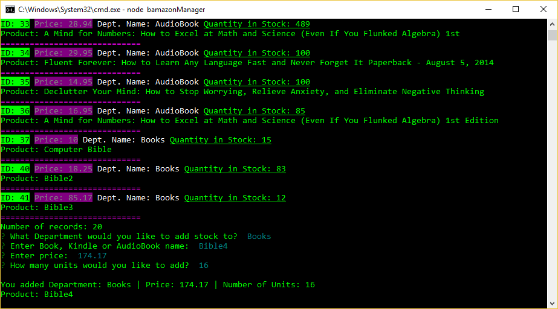

# Bamazon – Customer Module
bamazonManager.js
Amazon-like storefront using Node and MySQL

*Customer Module*

Welcome Screen: Choose to View Products for Sale (All Products), View Low Inventory < 50 units, Add to Inventory (existing inventory), and Add New Inventory (a new product not currently in the db).

Next screen – I chose “AudioBooks” – it returns list of Audiobooks.  I chose item 36, with a quantity of 80.  There are only 75 in stock, so it returns a message of “insufficient quantity”.

If there are enough in stock to fill the order, the system will generate a line indicating the product id, product name, number of units, price and total amount.  It will then update the stock_quantity in the products table and display the new quantity.

# Bamazon – Manager Module
bamazonManager.js
Amazon-like storefront using Node and MySQL

*Manager Module*

Welcome Screen: Choose to View Products for Sale (All Products), View Low Inventory < 50 units, Add to Inventory (existing inventory), and Add New Inventory (a new product not currently in the db).

Option: View Products for Sale

List all products and shows total number of records/products:

Option: View Low Inventory < 50 Units

Option: Add to Inventory

Takes in product id and quantity and updates the db.

Option: Add New Inventory

Adds a completely new item into the db.  It first uses an inquirer list to pick between Books, Kindle, and Audiobooks.  Then it prompts for the book name, price, and number of units (stock_quantity).  On number of units it defaults to 1 if you don’t enter anything.  It recaps what you entered and updates the db.

